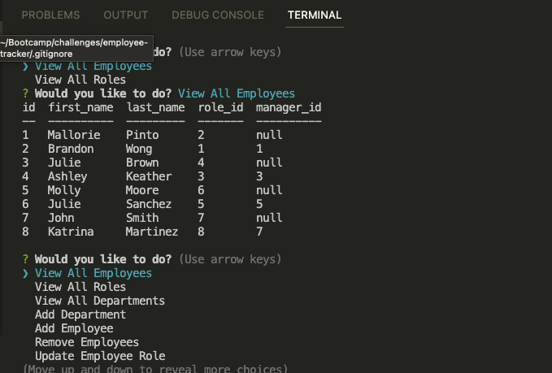

# employee-tracker

## Description
This is a command line application that allows the user to view an employee log.  The options will allow you to view the list of employees, departments, and roles in the company.  The app will also allow you to add an employee, department or role to the tracker.  When adding an employee, department or role the user will be prompted with questions regarding that specific additon.  I was only able to get the View Employees, View Departments, View Roles, Add Department, Add Role and Add employee functions to work.  This project help me to better understand switch statements, linking and exporting files, Mysql, and promises using .then().
 

## Installation

employee-tracker URL:  https://github.com/Pinto006/employee-tracker/tree/main

## Usage
 Before using the command-line application you will need to install npm i inquirer@8.2.4 in the intergrated terminal. Once installed, type node index.js into the command-line in the termainal and a list of options will be presented to the user. The options that are presented to the use are, View Employees, View Departments, View Roles, Add Department, Add Employee, Add Role, Remove Emoloyee, and Update Emplyee Role.  

## License

No License